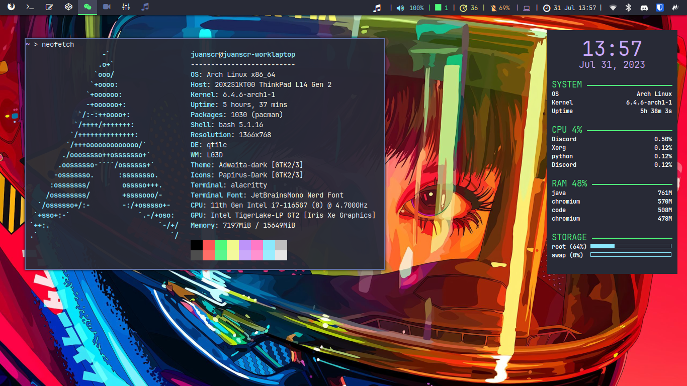
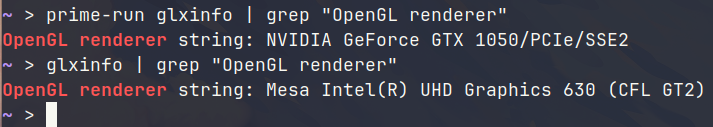

# My Dotfiles!
As an Arch Linux user myself, I passed most of my time in university customizing and
finding the perfect desktop environment. In this process, I tried and tested multiple
ones till I arrived to my current configuration. My focus has been on constructing a
functional and easy to use desktop experience, with aesthetics more of an after
thought.



In this repository, you'll find all the configuration of my desktop that you can use
for creating your own configuration files or, at least, get some inspiration on
creating your own. My desktop is mainly built by:

- [Qtile](https://github.com/qtile/qtile): A highly customizable tilling window manager
written in python.
- [Alacritty](https://github.com/alacritty/alacritty): A fast terminal emulator written
in rust.
- [Nvim](https://github.com/neovim/neovim): A fork of text editor vim improving
maintenaibility and extensability of the original project.
- [Dracula](https://github.com/dracula): A dark color scheme focused on usability.

And many more to compose a full desktop experience.

## Setup
To setup my dotfiles, first clone the bare repository in the desired place.

```bash
git clone --bare git@github.com:juanscr/arch_qtile_dotfiles.git
```

Then, use the following command to get all the files from the repository and, for
usability, stop showing files not uploaded to git.

```bash
alias dfiles="/usr/bin/git --git-dir=path/to/repository --work-tree=$HOME"
dfiles config status.showUntrackedFiles no
dfiles restore --staged .
dfiles checkout .
```

And there you go. Happy tinkering!

## Common Configuration Steps
In this section, you will find some common steps that I use in my computer to have
a fully working desktop experience. Although many of the information here can be found
in the Arch Wiki, I know first hand it is difficult to take in all the information
that the wiki presents at once; as such, the information presented here is a quick
summary of what I usually need to run on a freh installation of Arch.

### Table of Contents
- [Packages I use in my desktop](#installation-guide)
- [Sync time with chrony](#internet-sync)
- [Configure nvidia optimus](#nvidia-optimus)
- [Take care of your SDDs](#sdds)
- [Configure Logitech Mouse](#logitech-mouse)
- [Configure touchpad for better usability](#touchpad)
- [Configure keyboard](#keyboard)
- [Tidy your home directory](#xdg)
- [Improve look of qt5 apps](#qt5-platform)

<a name="installation-guide"></a>
### Installation Guide Annotations
When running the pacstrap command, is common to forget some basic packages that are
completely needed to have a fully working installation. For a minimal installation, I
would add the following packages to be installed so when you log in to the TTY some
basic functionality can be executed.

- `networkmanager`: Automatic configuration for network interfaces.
- `sudo`: Privilige escalation.
- `neovim`: Text editor.
- `grub`: Boot loader, for uefi support install `efibootmgr`.
- `man-db`, `man-pages`, `texinfo`: Package information.
- `intel-ucode`: Microcode for intel CPUs.
- `openssh`: SSH client.

Additionaly, the packages that I selected to construct my fully customized desktop
environment are:

- `git`: Version control.
- `base-devel`: AUR manager.
- `network-manager-applet`: Tray icon for network manager.
- `sddm`: Display manager.
- `qtile`: Tilling window manager, for using my configuration also install `python-psutil` and `python-dbus-next`.
- `dunst`: Notification daemon.
- `flameshot`: Screenshot tool.
- `chromium`: My preferred browser.
- `pulseaudio`: Audio control, for bluetooth and cli management install respectively `pulseaudio-bluetooth` and `pamixer`.
- `pavucontrol`: GUI for pulseaudio settings.
- `arandr`: UI for xrandr settings.
- `autorandr`: Automatic xrandr configuration by saving monitor configuration.
- `blueman`, `bluez` and `bluez-utils`: Bluetooth support and tray management.
- `polkit-gnome` and `polkit`: Privilige escalation.
- `playerctl`: Media controls.
- `spotify-launcher`: Spotify media launcher.
- `vlc`: Media player.
- `alacritty`: Rust terminal.
- `picom`: Compositor for X11.
- `chrony`: NTP time syncing.
- `xf86-input-libinput`: Touchpad customization.
- `bash-completion`: Autocompletion in bash.
- `hdparm`: Set hard drive parameters.
- `zathura`: PDF viewer.
- `nsxiv`: Simple image viewer.
- `exa`: ls but better.
- `feh`: Setup image background.
- `xorg-xrdb`: Set main color scheme in X11.
- `pcmanfm`: GUI File explorer.
- `conky` and `htop`: System monitoring.
- `pacman-contrib`: Includes scripts for checking updates in pacman.
- `xclip`: Paperclip management tool, necessary for copy-pasting to clipboard
  in vim.
- `fprintd` and `imagemagick`: Fingerprint authentication.
- `thermald`: Prevent overheating in intel CPUs.

On the other hand, I install fonts, gtk and qt themes so I can highly customize my
desktop environment look and feel. For that, I run:

- `ttf-jetbrains-mono` and `ttf-jetbrains-mono-nerd`: Main fonts I use.
- `gnome-themes-extra`: GTK theme for Adwaita Dark.
- `breeze`: QT Theme for Breeze Dark.
- `xcursor-vanilla-dmz`: Cursor theme.
- `papirus-icon-theme`: Pretty icon theme
- For other fonts, I install `ttf-dejavu`, `gnu-free-fonts`, `adobe-source-code-pro-fonts`, `cantarell-fonts`, `ttf-liberation`, `ttf-bitstream-vera`, `ttf-droid`, `noto-fonts`, `ttf-croscore`, `ttf-ibm-plex`.

Lastly, some additional packages I install outside the mainline arch repositories are:

- [yay](https://github.com/Jguer/yay): AUR package manager.
- [betterlockscreen](https://github.com/betterlockscreen/betterlockscreen): Beautiful lock screen.
- [rate-mirrors](https://github.com/westandskif/rate-mirrors): Rate arch mirros for download speed.
- [networkmanager-dispatcher-chrony](https://aur.archlinux.org/packages/networkmanager-dispatcher-chrony): Dispatch time sync to chrony when online.
- [qt5ct-kde](https://aur.archlinux.org/packages/qt5ct-kde): QT5ct for improved KDE compatibility.
- [dmenu](https://github.com/juanscr/dmenu): My own custom fork of dmenu.
- [python-pulsectl-asyncio](https://aur.archlinux.org/packages/python-pulsectl-asyncio): Necessary for running my qtile installation.

<a name="internet-sync"></a>
### Time Internet Synching
When I first did my Arch installation I notice that, as time passed on, the clock that
was showing on my desktop was slowly getting out of sync of the real time. That occured
because I didn't configure any network time syncing mechanisms to constantly sync the
time. For network time syncing, NTP is not suggested as laptops do not have a permanent
network connection and is really slow for time syncing. Instead use `chrony` that is
specifically designed to combat this issues. The Colombian NTP servers can be seen
[this page](https://www.ntppool.org/zone/co).

To activate the servers when I'm connected to a network, I use the following
[aur package](https://aur.archlinux.org/packages/networkmanager-dispatcher-chrony/).
Remember to install the `chrony` package and enable `chronyd.service`;
additionally, disable and stop `systemd-timesyncd` for enabling chrony properly.
My chrony configuration file is:

```
# Colombia NTP servers
server 3.co.pool.ntp.org iburst offline
server 0.south-america.pool.ntp.org iburst offline
server 1.south-america.pool.ntp.org iburst offline

rtcsync

# Drift file
driftfile /var/lib/chrony/drift

# If you specify an NTP server with the nts option to enable authentication
# with the Network Time Security (NTS) mechanism, or enable server NTS with
# the ntsservercert and ntsserverkey directives below, the following line will
# allow the client/server to save the NTS keys and cookies in order to reduce
# the number of key establishments (NTS-KE sessions).

ntsdumpdir /var/lib/chrony

# If the system timezone database is kept up to date and includes the
# right/UTC timezone, chronyd can use it to determine the current
# TAI-UTC offset and when will the next leap second occur.

leapsectz right/UTC

# INITIAL CLOCK CORRECTION
makestep 1.0 3
```

<a name="nvidia-optimus"></a>
### Nvidia Optimus
On my personal laptop, I have an integrated Intel Graphics card with a discrete Nvidia
GeForce GTX 1050. This setup is common in laptops to improve battery life, by mostly
using the intel graphics card and delivering the more intensive tasks to the nvidia
card. Although the easiest route is to make the Nvidia card the default one and turn
off the Intel one (which I used for many years), the battery life clocked below an
hour and the computer had really high temperatures most of the time.

For that, I switched to use PRIME GPU Offloading in order to just use the Nvidia GPU
when needed (i.e., running steam and other intensive tasks). The related Arch wiki
pages that cover how to configure it are:

- [Prime Offload](https://wiki.archlinux.org/title/PRIME#PRIME_render_offload).
- [NVIDIA driver wiki](https://wiki.archlinux.org/title/NVIDIA).

First, I installed the respective graphics driver for Nvidia and Intel with vulkan
support (with their respective 32 bits libraries from the
[multilib](https://wiki.archlinux.org/title/official_repositories#multilib)
repository):

```
pacman -S \
    nvidia nvidia-utils lib32-nvidia-utils \
    mesa intel-media-driver lib32-mesa \
    vulkan-intel lib32-vulkan-intel \
    nvidia-prime
```

Then, I removed `kms` from the `HOOKS` key in `/etc/mkinitcpio.conf` to avoid booting
with the `nouveau` module (open source nvidia driver). Then regenerate the initramfs
by:

```
mkinitcpio -P
```

After that, I created the `pacman` hook in order to always regenerate the initramfs
when updating the `nvidia` package. By that I created the
`/etc/pacman.d/hooks/nvidia.hook` with:

```
[Trigger]
Operation=Install
Operation=Upgrade
Operation=Remove
Type=Package
Target=nvidia
Target=linux
# Change the linux part above if a different kernel is used

[Action]
Description=Update NVIDIA module in initcpio
Depends=mkinitcpio
When=PostTransaction
NeedsTargets
Exec=/bin/sh -c 'while read -r trg; do case $trg in linux*) exit 0; esac; done; /usr/bin/mkinitcpio -P'
```

Then, I executed a reboot to load the `nvidia` propietary driver. For veryfing that it
worked as I expected, I did the following commands and got the correct output:



<a name="sdds"></a>
### Solid State Drives
In my personal and work laptop, I posses an NVMe SSD. Arch Linux has whole sections
in their wiki dedicated to optimizing and taking care of the solid states drives that I
suggest you read by yourself as it has a lot of content to parse. In this section,
you'll find a little summary of what commands do I run to take care and optimize
my SSD.

In first place, I activate TRIM. At first, verify if the SSD supports TRIM by running
the following command:

```bash
lsblk --discard
```

Verifying that the `DISC-GRAN` and `DISC-MAX` have non-zero values which means
it supports TRIM operations. After that, if the values are non-zero, active a
periodic trim by using the following commands:

```bash
sudo pacman -S util-linux
systemctl enable --now fstrim.timer
```

<a name="logitech-mouse"></a>
### Logitech Mouse Customization
I have a [Logitech G3000s](https://www.logitechg.com/en-eu/products/
gaming-mice/g300s-gaming-mouse.910-004345.html) mouse. This mouse has some colors to
switch through by default and it can be customized to have different colors.
Additionally, it has some custom buttons that allow to be customized.

Using the `ratslap` command, the color and buttons can be set. To changing the
color to red and having the two middle buttons to change between tabs use:

```bash
sudo ratslap \
      --modify F3 \
      --colour red \
      --G8 LeftCtrl+PageUp \
      --G9 LeftCtrl+PageDown \
      --print F3 \
      --select F3
```

<a name="touchpad"></a>
### Touchpad Configuration
For configuring the touchpad for a more natural behavior, the `libinput` package was
used as is the currently use package for managing input devices; for making it work in
Xorg run the following command:

``` bash
sudo pacman -S xf86-input-libinput
```

And restart the graphical environment so the devices are now managed by libinput. Then,
to configure the touchpad for the following features:

- Tapping for left click.
- Tapping with two fingers for right click.
- Tapping with three fingers for middle click (paste).
- Natural scrolling, similar to windows.

Create the file `/etc/X11/xorg.conf.d/30-touchpad.conf` and write:

```
Section "InputClass"
    Identifier "libinput touchpad catchall"
    MatchIsTouchpad "on"
    MatchDevicePath "/dev/input/event*"
    Driver "libinput"
    Option "Tapping" "on"
    Option "ClickMethod" "clickfinger"
    Option "NaturalScrolling" "true"
EndSection
```

And then restart your computer to reload xorg.

<a name="keyboard"></a>
### Keyboard Layout Configuration
For my personal laptop, I use the following configuration for my keyboard layout:
- The US keyboard layout as I find the best one for programming.
- The `altgr-intl` variant in order to write in spanish easily and quickly.
- The Caps Lock and Escape keys are swapped in order for improved VIM-like usage.

For setting this in an Xorg server, use the following command:

```
localectl --no-convert set-x11-keymap us evdev altgr-intl caps:swapescape
```

<a name="xdg"></a>
### XDG Base Directory Specification
The XDG Base Directory Specification is a directory specification which hopes to protect
the user home directory from being spammed with multiple unnecessary directories that
are used to store data and configuration from multiple apps.
[Read the specification here.]\
(https://specifications.freedesktop.org/basedir-spec/basedir-spec-latest.html)

For complying with the standard, set the following variables in the file
`/etc/profile.d/xdg_compliance.sh`:

```
export XDG_CONFIG_HOME="$HOME"/.config
export XDG_CACHE_HOME="$HOME"/.cache
export XDG_DATA_HOME="$HOME"/.local/share
```

Other global variables I set for multiple other apps for complying with the
specification are:

```
export XINITRC="$XDG_CONFIG_HOME"/X11/xinitrc

export GTK2_RC_FILES="$XDG_CONFIG_HOME"/gtk-2.0/gtkrc

export IPYTHONDIR="$XDG_CONFIG_HOME"/jupyter
export JUPYTER_CONFIG_DIR="$XDG_CONFIG_HOME"/jupyter

export CARGO_HOME="$XDG_DATA_HOME"/cargo
export RUSTUP_HOME="$XDG_DATA_HOME"/rustup

export ASPELL_CONF="per-conf $XDG_CONFIG_HOME/aspell/aspell.conf;"
export ASPELL_CONF="${ASPELL_CONF} personal $XDG_CONFIG_HOME/aspell/en.pws;"
export ASPELL_CONF="${ASPELL_CONF} repl $XDG_CONFIG_HOME/aspell/en.prepl;"

export NPM_CONFIG_USERCONFIG="$XDG_CONFIG_HOME"/npm/npmrc

export LESSHISTFILE="$XDG_CACHE_HOME"/less/history

export PASSWORD_STORE_DIR="$XDG_DATA_HOME"/pass

export TEXMFVAR="$XDG_CACHE_HOME"/texlive/texmf-var

export PYLINTHOME="$XDG_CACHE_HOME"/pylint

export DOCKER_CONFIG="$XDG_CONFIG_HOME"/docker

export AWS_SHARED_CREDENTIALS_FILE="$XDG_CONFIG_HOME"/aws/credentials
export AWS_CONFIG_FILE="$XDG_CONFIG_HOME"/aws/config
```

<a name="qt5-platform"></a>
### QT5 Platform
For configuring the QT5 applications, I use `qt5ct` which allows for configuration to
the platform similar as `lxapperance` to the X11 server. In this manner, to configure
the QT apps `qt5ct` write the following file `/etc/profile.d/qt5_vars.sh`:

```
export QT_QPA_PLATFORMTHEME=qt5ct
```

