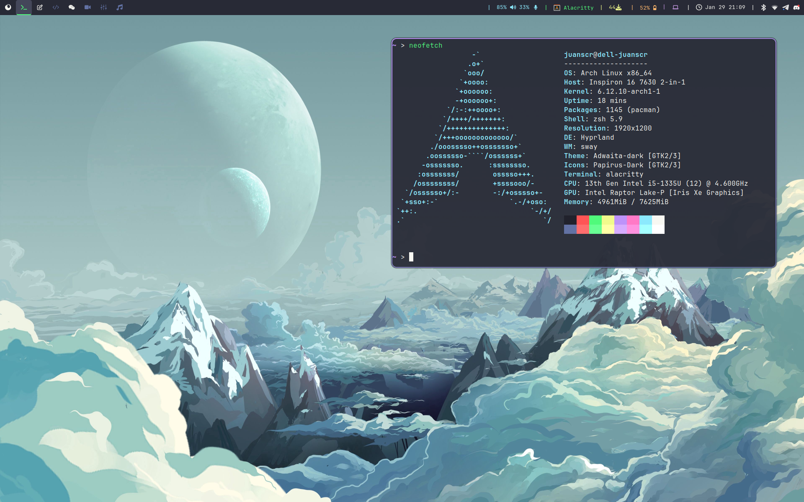

# My Dotfiles!
As an Arch Linux user myself, I passed most of my time in university customizing and
finding the perfect desktop environment. In this process, I tried and tested multiple
ones till I arrived to my current configuration. My focus has been on constructing a
functional and easy to use desktop experience, with aesthetics more of an after
thought.



In this repository, you'll find all the configuration of my desktop that you can use
for creating your own configuration files or, at least, get some inspiration on
creating your own. My desktop is mainly built by:

- [Qtile](https://github.com/qtile/qtile): A highly customizable tilling window manager
written in python.
- [Alacritty](https://github.com/alacritty/alacritty): A fast terminal emulator written
in rust.
- [Nvim](https://github.com/neovim/neovim): A fork of text editor vim improving
maintenaibility and extensability of the original project.
- [Dracula](https://github.com/dracula): A dark color scheme focused on usability.

And many more to compose a full desktop experience.

## Setup
To setup my dotfiles, first clone the bare repository in the desired place.

```bash
git clone --bare git@github.com:juanscr/arch_qtile_dotfiles.git
```

Then, use the following command to get all the files from the repository and, for
usability, stop showing files not uploaded to git.

```bash
alias dfiles="/usr/bin/git --git-dir=path/to/repository --work-tree=$HOME"
dfiles config status.showUntrackedFiles no
dfiles restore --staged .
```

And there you go. Happy tinkering!

## Common Configuration Steps
In this section, you will find some common steps that I use in my computer to have
a fully working desktop experience. Although many of the information here can be found
in the Arch Wiki, I know first hand it is difficult to take in all the information
that the wiki presents at once; at such, the information here is summarized for a way
easier consumption.

### Installation Guide Annotations
When running the pacstrap command, is common to forget some basic packages that are
completely needed to have a fully working installation. For a minimal installation, I
would add the following packages to be installed so when you log in to the TTY some
basic functionality can be executed.

```
pacstrap -K /mnt \
    base linux linux-firmware \ # Base packages
    networkmanager \            # Network manager
    neovim \                    # Neovim, text editor.
    sudo \                      # Privilige escalation
    grub efibootmgr \           # Boot loader
    man-db man-pages texinfo \  # Package information
    intel-ucode \               # Microcode for intel CPUs
    openssh                     # SSH client
```

Additionaly, the packages that I selected to construct my fully customized desktop
environment are:

```
pacman -S \
    git \
    base-devel \                              # AUR
    network-manager-applet \                  # Tray icon for network manager
    sddm \                                    # Display manager
    qtile python-psutil python-dbus-next \    # Tiling window manager
    dunst \                                   # Notification daemon
    flameshot \                               # Screenshot tool
    chromium \                                # Browser
    pulseaudio pulseaudio-bluetooth pamixer \ # Audio manager
    pavucontrol \                             # GUI for pulseaudio settings
    arandr \                                  # UI for xrandr settings
    autorandr \                               # Automatic xrandr configuration
    blueman bluez bluez-utils \               # Bluetooth
    polkit-gnome polkit \                     # Privilige escalation
    playerctl \                               # Media controls
    spotify-launcher \                        # Spotify media controller
    vlc \                                     # Media player
    alacritty \                               # Terminal
    picom \                                   # Compositor for X11
    chrony \                                  # NTP time syncing
    xf86-input-libinput \                     # Touchpad customization
    bash-completion \                         # Autocompletion in bash
    hdparm \                                  # Set hard drive parameters
    zathura \                                 # PDF viewer
    nsxiv \                                   # Image viewer
    exa \                                     # ls but better
    feh \                                     # Setup image background
    pcmanfm \                                 # GUI File explorer
    conky htop                                # System monitoring
```

On the other hand, I install fonts, gtk and qt themes so I can highly customize my
desktop environment look and feel. For that, I run:

```
pacman -S \
    ttf-jetbrains-mono ttf-jetbrains-mono-nerd \ # Main fonts I use
    gnome-themes-extra \                         # GTK themes
    breeze \                                     # QT Themes
    xcursor-vanilla-dmz \                        # Cursor theme
    papirus-icon-theme \                         # Pretty icon theme

    # Other fonts
    ttf-dejavu \
    gnu-free-fonts \
    adobe-source-code-pro-fonts \
    cantarell-fonts \
    ttf-liberation \
    ttf-bitstream-vera \
    ttf-droid \
    noto-fonts \
    ttf-croscore \
    ttf-ibm-plex
```

Lastly, some additional packages I install outside the mainline arch repositories are:
- [yay](https://github.com/Jguer/yay): AUR package manager.
- [betterlockscreen](https://github.com/betterlockscreen/betterlockscreen): Beautiful lock screen.
- [rate-mirrors](https://github.com/westandskif/rate-mirrors): Rate arch mirros for download speed.
- [networkmanager-dispatcher-chrony](https://aur.archlinux.org/packages/networkmanager-dispatcher-chrony): Dispatch time sync to chrony when online.
- [qt5ct-kde](https://aur.archlinux.org/packages/qt5ct-kde): QT5ct for improved KDE compatibility.
- [dmenu](https://github.com/juanscr/dmenu): My own custom fork of dmenu.

### Time Internet Synching
When I first did my Arch installation I notice that, as time passed on, the clock that
was showing on my desktop was slowly getting out of sync of the real time. That occured
because I didn't configure any network time syncing mechanisms to constantly sync the
time. For network time syncing, NTP is not suggested as laptops do not have a permanent
network connection and is really slow for time syncing. Instead use `chrony` that is
specifically designed to combat this issues. The Colombian NTP servers can be seen
[this page](https://www.ntppool.org/zone/co).

To activate the servers when I'm connected to a network, I use the following
[aur package](https://aur.archlinux.org/packages/networkmanager-dispatcher-chrony/).
Remember to install the `chrony` package and enable `chronyd.service`;
additionally, disable and stop `systemd-timesyncd` for enabling chrony properly.
My chrony configuration file is:

```
# Colombia NTP servers
server 3.co.pool.ntp.org iburst offline
server 0.south-america.pool.ntp.org iburst offline
server 1.south-america.pool.ntp.org iburst offline

rtcsync

# Drift file
driftfile /var/lib/chrony/drift

# If you specify an NTP server with the nts option to enable authentication
# with the Network Time Security (NTS) mechanism, or enable server NTS with
# the ntsservercert and ntsserverkey directives below, the following line will
# allow the client/server to save the NTS keys and cookies in order to reduce
# the number of key establishments (NTS-KE sessions).

ntsdumpdir /var/lib/chrony

# If the system timezone database is kept up to date and includes the
# right/UTC timezone, chronyd can use it to determine the current
# TAI-UTC offset and when will the next leap second occur.

leapsectz right/UTC

# INITIAL CLOCK CORRECTION
makestep 1.0 3
```
